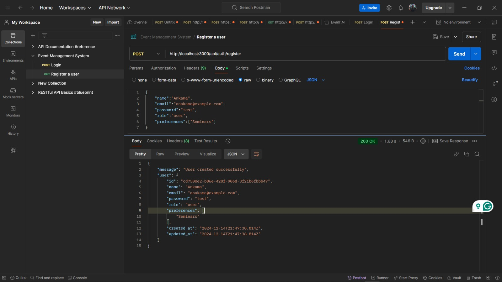
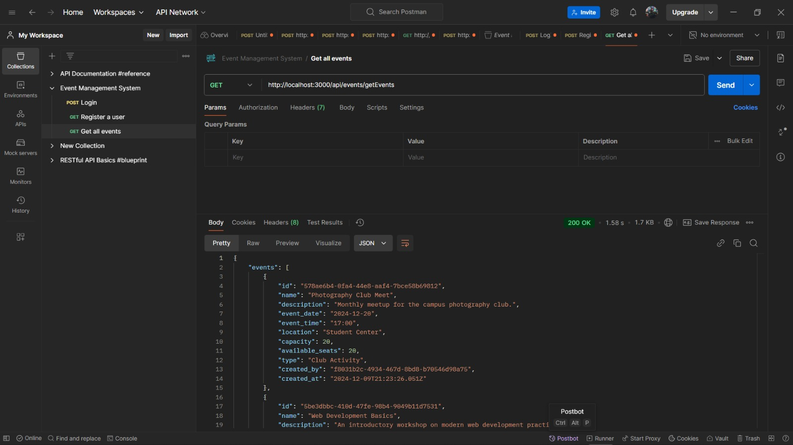

# **Campus Event Management Hub**

## **Project Overview**  
The Campus Event Management Hub is a web application designed to help students and staff easily view and register for campus events like workshops, seminars, and club activities. Users can register an account, customize their event preferences, view detailed event listings, RSVP, and access a calendar view for scheduled activities. Administrators have exclusive permissions to create and manage events, ensuring streamlined event coordination.

---

## **Deployment Link**  
[Deployed Application Link](https://event-management-system-nine-liart.vercel.app/)  

---

## **Login Details**  
For testing purposes, you can use the following credentials:  

### Regular User:
- **Username**: user@mail.com  
- **Password**: User1234  

### Admin User:
- **Username**: Admin@mail.com  
- **Password**: Admin1234  

---

## **Feature Checklist**  
| Feature                           | Status        |
|-----------------------------------|---------------|
| **User Registration & Login**     | ✅ Completed  |
| **Set Event Preferences**         | ✅ Completed  |
| **Event Listings with RSVP**      | ✅ Completed  |
| **Event Creation (Admin Only)**   | ✅ Completed  |
| **Unique Event IDs**              | ✅ Completed  |
| **Event Calendar View**           | ✅ Completed  |
| **Event Capacity Management**     | ✅ Completed  |
| **Event Filtering by Preferences**| ✅ Completed  |

---

## **API Documentation Screenshots**
Below are screenshots of API endpoints tested in Postman:

### Authentication Endpoints

### Event Endpoints

### User Endpoints

---

## **Installation Instructions**  
